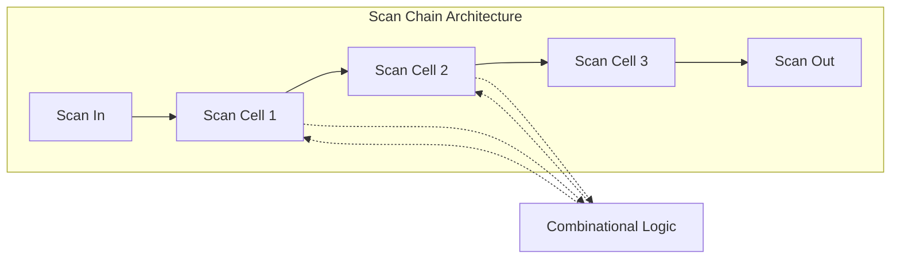

# EE5217_Tue: Design for Test by Means of Scan

<!-- markdownlint-disable MD033 -->

  
  
  

<!-- markdownlint-enable MD033 -->

---

## 📖 Giới thiệu

Dự án này tập trung vào phương pháp **Design for Test (DFT)** sử dụng kỹ thuật **Scan**. Đây là một trong những phương pháp quan trọng nhất trong thiết kế vi mạch hiện đại để đảm bảo khả năng kiểm tra (testability) của các mạch logic tuần tự phức tạp.

## 🚀 Các khái niệm cốt lõi (Core Concepts)

### 1. Scan Cell & Scan Chain

Trong chế độ kiểm tra, các Flip-Flop thông thường được thay thế bằng các **Scan Flip-Flops**. Các tế bào này được kết nối nối tiếp với nhau tạo thành một mạch dịch dài gọi là **Scan Chain**.

### 2. Các giai đoạn kiểm tra (Test Phases)

Quy trình kiểm tra Scan diễn ra qua 3 bước chính:

1. **Shift-In**: Nạp các vector kiểm tra (test patterns) vào chuỗi Scan.
2. **Capture**: Chuyển mạch sang chế độ hoạt động bình thường để bắt các chân giá trị từ logic tổ hợp.
3. **Shift-Out**: Đẩy kết quả ra ngoài để so sánh và phát hiện lỗi.

## 💎 Lợi ích của Scan DFT

- **Độ bao phủ lỗi cao (High Fault Coverage):** Cho phép kiểm tra hầu hết các nút logic bên trong chip.
- **Tự động hóa ATPG:** Đơn giản hóa việc tạo vector kiểm tra tự động (Automatic Test Pattern Generation).
- **Giảm chi phí:** Rút ngắn thời gian kiểm tra và chẩn đoán lỗi sau khi sản xuất.

---
*Dự án thuộc học phần: Sản xuất, Kiểm tra và Đóng gói vi mạch.*
